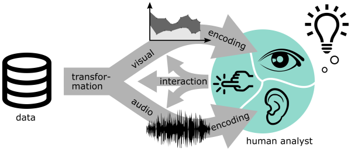

<!-- <section class="hero is-medium is-bold is-primary">
    

        

            
{{ page.subtitle }}

            <figure class="image">
                
            </figure>
        

    

</section> -->

{:class="img-responsive"}

Visualization and sonification are two approaches for conveying data to humans based on complementary high-bandwidth information processing systems. Kramer et al.  defined sonification as “the use of nonspeech audio to convey information.” Tamara Munzner defines visualization as follows: “Computer-based visualization systems provide visual representations of datasets designed to help people carry out tasks more effectively.” Both visualization and sonification address the purpose of involving human analysts in data analysis. There are several similarities between the methods and design theories of both approaches, such as the use of perceptual variables to encode data attributes, and the role of interaction in manipulating the data representations.

Over the recent decades, both fields have established research communities, theoretical frameworks, and toolkit support. Although extensive research has been carried out both on the auditory andvisual representation of data, comparatively little is known about their systematic and complementary combination for data analysis. One example of multimodal research is Keith Nesbitt’s dissertation. Also, Walker and Kramer pointed out that research on the design and the use of multimodal sonification is important to drive sonification and visualization research forward. There are potential powerful synergies in combining both modalities to address the individual limitations of each one. Nevertheless, existing research on combinations has often focused only on one of the modalities.

**More information about the workshop will be published here in time before the event.**
